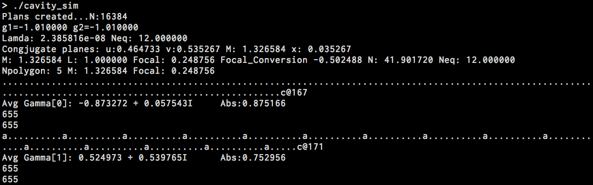
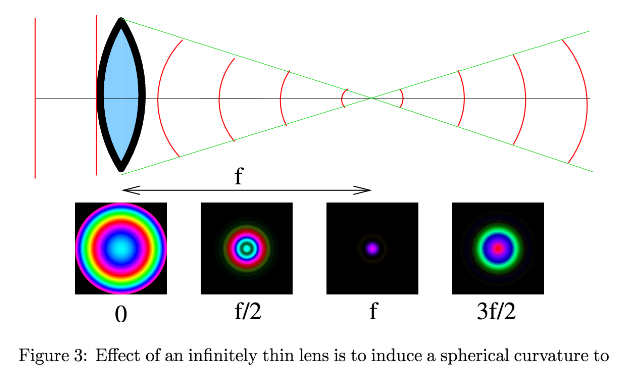

# FractalLight

Unbelievably the 1D version of the code compiled as is, and started running & finding eigenmodes! The 2D version (which makes pretty pictures) fails to compile with a linker warning, probably due to bounds checking / 32/64bit failure.

Example from 2006 of generated 2D modes:

## Abstract (from the 2006 MSci report)

Codes were written to simulate the propagation of monochromatic light
through a bare optical resonator, using a computational Fourier method to
solve the Huygens-Fresnel integral. This was used, in the Fox-Li method, to
find the lowest-loss eigenmodes of arbitrary cavity designs. An implicit shift
‘hopping’ method was employed to allow a series of increasingly higher-loss
eigenmodes to be found, limited in number by computational time.

Codes were confirmed in their accuracy against the literature, and were
used to investigate a number of different cavity configurations.

In addition to confirming the fractal nature of eigenmodes imaged at the
conjugate plane of a symmetric (g < −1) resonator, an initial study was
made of how the (imperfect) quality of the fractal fit varied as the defining
aperture was moved around the cavity.

A comparison was also made with the fractal-patterns produced by codes
written to simulate basic video-feedback.
